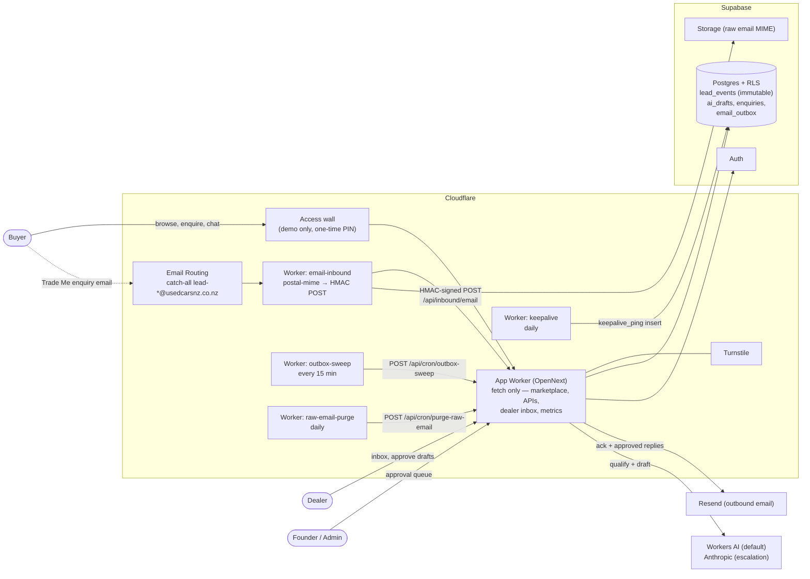
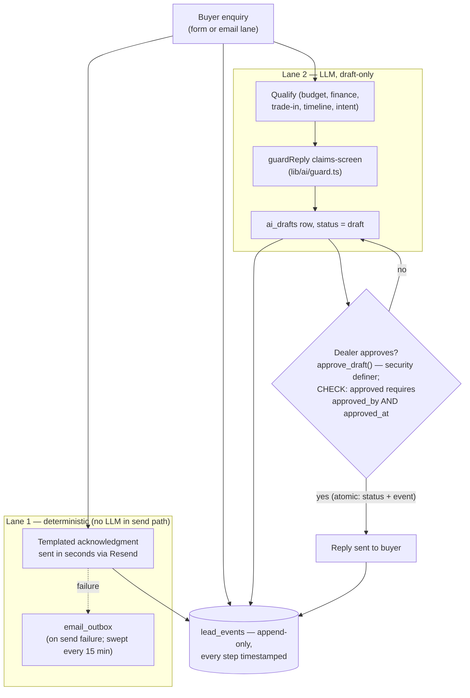
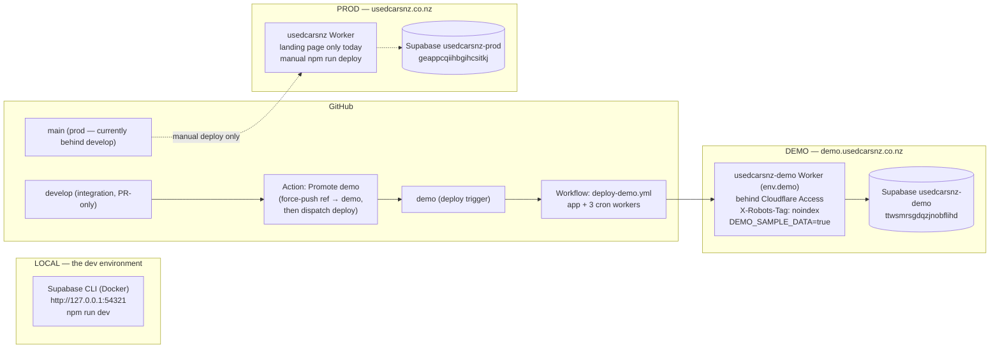
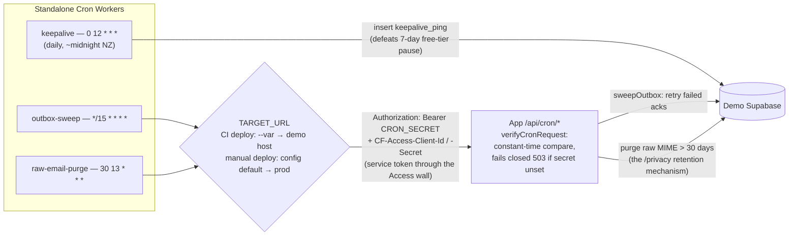

# UsedCarsNZ — Architecture

*Created 19 July 2026, verified against `develop`. One page, four diagrams.
GitHub renders the Mermaid blocks natively.*

## The two invariants (read these first)

1. **The OpenNext app worker exports only `fetch`.** It cannot hold a
   `scheduled` handler, so **every cron job is a standalone Worker** under
   `workers/` that POSTs an authenticated app endpoint. Do not consolidate
   crons onto the app worker — the trigger would fire into a void.
2. **`lead_events` is append-only, enforced by a DB trigger** (UPDATE/DELETE/
   TRUNCATE rejected for every role). Corrections are appended as compensating
   events, never mutations. Every conversion metric reads exclusively from this
   log — its immutability *is* the product's proof claim.

---

## 1. System context

Everything user-facing runs through the OpenNext app worker; four standalone
Workers handle email ingestion and schedules. Supabase holds all state; Resend
sends; Email Routing receives; Access walls the demo.

## 2. The two AI lanes and the approve→send gate

Lane 1's send path is deterministic — no LLM can delay or distort the sub-60s
acknowledgment. Lane 2's LLM output can only ever become a buyer-visible
message through the DB-enforced dealer approval gate.

Compliance is proven by feeding deliberately bad output through `guardReply`
via the deterministic mock adapter (`lib/ai/__tests__/fake-provider.ts`) — a
green live-model run proves nothing about the envelope (Strategy §7).

## 3. Environments and deploy topology

Two cloud environments plus local — there is no cloud dev project (Supabase
free tier caps at two). Production deliberately has **no CI deploy**.

Secrets live in three places, set once each: the app worker
(`wrangler secret put <NAME> --env demo`: `SUPABASE_SECRET_KEY`,
`TURNSTILE_SECRET_KEY`, `RESEND_API_KEY`, `CRON_SECRET`, optional
`ANTHROPIC_API_KEY` / `INBOUND_HMAC_SECRET`); each standalone worker (keepalive
→ `SUPABASE_SECRET_KEY`; sweep/purge → `CRON_SECRET` + `CF_ACCESS_*`;
email-inbound → `INBOUND_HMAC_SECRET`); and GitHub repo secrets for the deploy
workflow (`CLOUDFLARE_API_TOKEN`, `CLOUDFLARE_ACCOUNT_ID`, three
`DEMO_NEXT_PUBLIC_*`). Names only here — values never appear in the repo.

## 4. Cron wiring

Thin scheduled Workers poke authenticated app endpoints; the tested logic stays
in the app. `TARGET_URL` resolution is the part people get wrong — CI overrides
it to demo; the config default (prod) applies only to manual deploys.

Never set worker **vars** in the Cloudflare dashboard: `wrangler deploy` runs
with `--keep-vars` false, so every CI deploy re-asserts config/`--var` values
and silently clobbers dashboard edits. Secrets are never clobbered. Schedules
are deliberately offset so no two jobs collide. Full table:
`docs/infra/cron-schedules.md`.
